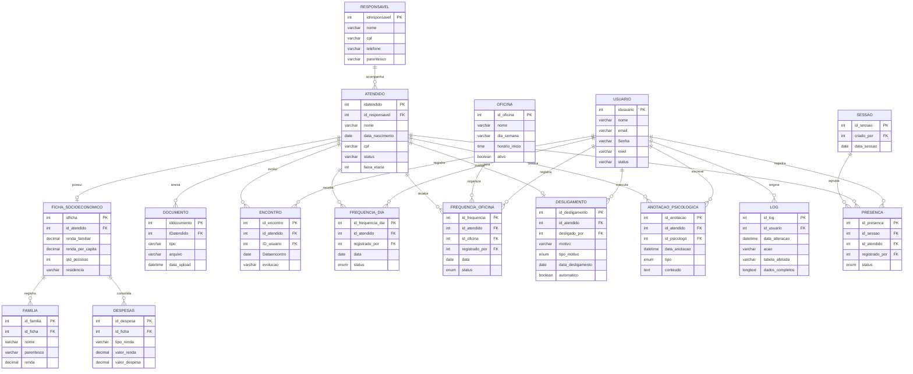

# DER - Modelo de Dados Atual

Fonte: `database/SETUP_COMPLETO_FINAL.sql`, validado por importação em
MariaDB em 05/09/2026. O diagrama mostra as entidades centrais; campos descritivos
foram resumidos para manter a leitura.

## Tabelas de infraestrutura

- `agenda`: avisos e notificações do dashboard;
- `password_reset_tokens`: hashes temporários de recuperação de senha;
- `auth_rate_limits`: limitação de tentativas de autenticação;
- `dias_atendimento`: apoio ao calendário;
- `atendidos_com_alerta`: view derivada de faltas.

`sessao` e `presenca` são estruturas legadas mantidas por compatibilidade.
Os fluxos atuais usam principalmente `frequencia_dia` e
`frequencia_oficina`.
