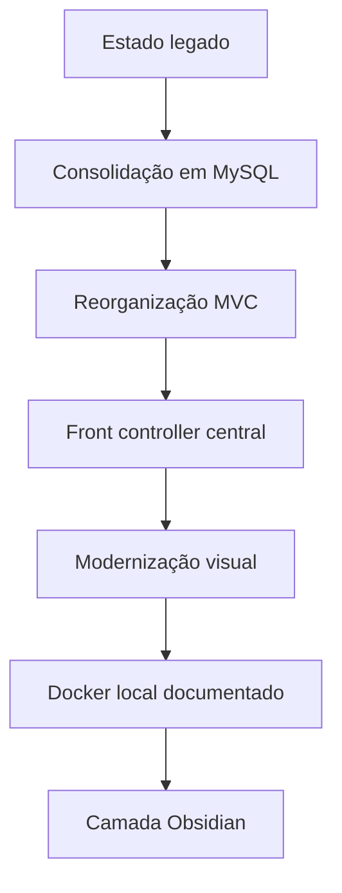

# Relação Geral de Alterações e Melhorias do Projeto

Atualizado em 2026-06-01.

Este documento registra o ciclo de modernização do **Sistema Criança Feliz** e o estado atual das principais mudanças estruturais, funcionais e visuais do repositório.

## 1. Consolidação de Persistência

O projeto passou a operar com persistência principal em MySQL/MariaDB via PDO. Arquivos JSON locais deixaram de ser a fonte primária dos dados de negócio.

Principais pontos:

- `app/Config/App.php` define `STORAGE_MODE = 'mysql'`.
- Models principais foram consolidados em `app/Models/`.
- Dados de calendário/notas do dashboard usam a tabela `agenda`.
- A pasta `data/` permanece para dados runtime locais, como `reset_tokens.json`, e não deve ser tratada como banco principal.

Arquivos relevantes:

- `app/Config/Database.php`
- `app/Config/App.php`
- `app/Models/BaseModel.php`
- `app/Models/Acolhimento.php`
- `app/Models/Socioeconomico.php`
- `app/Models/FrequenciaDia.php`
- `app/Models/FrequenciaOficina.php`
- `app/Models/Desligamento.php`
- `app/Models/Log.php`

## 2. Reorganização da Aplicação

A aplicação foi reorganizada em camadas simples:

- `app/Controllers`: entrada das ações MVC.
- `app/Services`: regras de negócio.
- `app/Models`: persistência.
- `app/Views`: telas e layouts.
- `css`, `js`, `img`: assets públicos.
- `database`: SQL, migrações e diagnóstico.
- `docker`: inicialização auxiliar do MySQL em container.
- `tools`: scripts auxiliares.
- `tests/manual`: testes manuais.
- `docs`: documentação.
- notas raiz `00`, `01` e `02`: painel Obsidian, backlog e guia de uso com Codex.

O estado atual usa `index.php` como front controller único. O arquivo `.htaccess` redireciona rotas inexistentes para `index.php` no Apache, e `var/dev-router.php` faz o equivalente no servidor embutido do PHP.

## 3. Rotas e Módulos

Módulos ativos principais:

- autenticação e recuperação de senha;
- dashboard;
- prontuários;
- acolhimento;
- socioeconômico;
- faltas/frequência;
- desligamento;
- área psicológica;
- usuários;
- logs/auditoria;
- perfil.

O módulo atual de frequência é `faltas.php`, usando `FaltasController`, `FrequenciaDia`, `FrequenciaOficina` e `Oficina`.

O antigo fluxo `attendance.php` foi removido fisicamente. A rota legada agora redireciona para o módulo atual `faltas.php` ou para `desligamento.php`, conforme a ação.

## 4. Banco de Dados

O setup principal fica em:

- `database/SETUP_COMPLETO_FINAL.sql`

Arquivos auxiliares:

- `database/migration.sql`
- `database/update_schema.sql`
- `database/migrate.php`
- `database/test_connection.php`
- `database/legacy_dumps/`
- `docker/mysql/01-init.sh`
- `docker/mysql/02-missing-views.sql`

Melhorias realizadas ou documentadas:

- uso de PDO com prepared statements;
- validação explícita da extensão `pdo_mysql`;
- suporte a variáveis de ambiente `DB_*`;
- triggers de auditoria para ficha socioeconômica;
- tabelas de frequência diária e por oficina;
- modelos MySQL como fonte principal dos módulos.
- ambiente Docker Compose para desenvolvimento local com app, MySQL e phpMyAdmin.

Pontos ainda pendentes:

- normalizar nomes de tabela em maiúsculas/minúsculas para evitar falhas em Linux;
- alinhar completamente `SETUP_COMPLETO_FINAL.sql`, `migration.sql` e `update_schema.sql`;
- manter `anotacao_psicologica` alinhada entre setup completo, migração e ambientes existentes;
- decidir se tabelas legadas como `sessao` e `presenca` serão preservadas ou removidas do setup final.

## 5. Segurança

Melhorias aplicadas:

- CSRF em fluxos sensíveis;
- senhas centralizadas em `PasswordHelper`, com Argon2id quando disponível e fallback bcrypt;
- prepared statements;
- headers básicos de segurança;
- controle de acesso por sessão e perfil;
- exclusões de acolhimento/socioeconômico por POST;
- logs de auditoria em ações relevantes.

Pontos importantes:

- `admin` tem acesso administrativo amplo, mas não acessa a área psicológica pela regra atual de permissões.
- `psicologo` acessa a área psicológica.
- `funcionario` possui acesso básico de consulta.
- `.htaccess` bloqueia acesso web direto a `tools/`, `database/`, `data/`, `var/` e `docker/` no Apache.
- recuperação de senha ainda exige SMTP real para produção.

## 6. Modernização Visual

O frontend recebeu uma camada visual mais consistente:

- variáveis CSS em `css/style.css`;
- suporte a tema claro/escuro;
- classes reutilizáveis para cards, badges, status, tabelas e botões;
- redução de estilos inline em telas principais;
- `js/theme-toggle.js` focado em alternância de tema via atributo `data-theme`;
- estilos específicos de acolhimento em `css/acolhimento-form.css`.

Documento complementar:

- `docs/STYLING_UPGRADE.md`

## 7. Documentação Atualizada

Documentos principais:

- `README.md`: guia de entrada do repositório.
- `docs/PROJECT_DOCUMENTATION.md`: documentação técnica.
- `docs/MAINTENANCE_AND_TESTING.md`: manutenção, scripts e testes.
- `database/README_SETUP.md`: setup do banco.
- `docs/STYLING_UPGRADE.md`: padrões visuais.
- `docs/archive/`: histórico antigo preservado.

## 8. Correção de Lacunas em 2026-06-01

- Testes automatizados mínimos adicionados em `tests/automated/` com runner `tests/run.php`.
- CI adicionada em `.github/workflows/ci.yml`.
- Plano LGPD e governança criado em `docs/LGPD_AND_DATA_GOVERNANCE.md`.
- Plano de normalização do banco criado em `docs/DATABASE_NORMALIZATION_PLAN.md`.
- Foto de perfil passou a persistir em `usuario.foto_perfil`.
- Prontuário passou a listar e receber documentos anexados por admin.
- Logs detalhados de debug passaram a obedecer `APP_DEBUG`.
- Roadmap de relatórios criado em `docs/REPORTING_ROADMAP.md`.
- Rastreabilidade dos requisitos criada em `docs/REQUIREMENTS_TRACEABILITY.md`.
- `00 - Painel do Projeto Criança Feliz.md`: navegação Obsidian do projeto.
- `01 - Backlog Técnico.md`: pendências priorizadas em formato de tarefas.
- `02 - Guia de Uso com Codex.md`: fluxo recomendado para trabalhar com Codex no projeto.

## 8. Pendências Recomendadas

Prioridade alta:

- configurar SMTP real;
- normalizar nomes de tabelas.

Prioridade média:

- criar testes automatizados;
- revisar endpoints psicológicos ainda não implementados;
- reduzir o tamanho do roteador em `index.php`;
- alinhar os scripts SQL principais.

Prioridade baixa:

- comprimir imagens grandes;
- padronizar idioma de nomes internos;
- avaliar Composer/autoload PSR-4 em uma próxima evolução.
