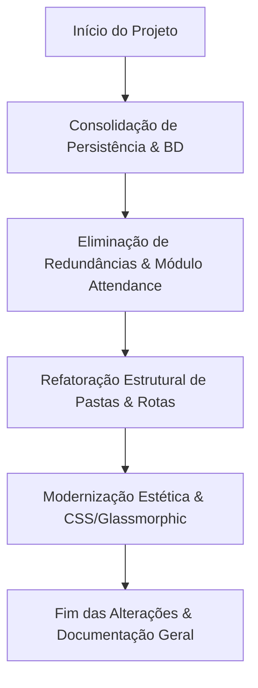

# Relação Geral de Alterações e Melhorias do Projeto

Este documento apresenta o relatório completo de todas as alterações, refatorações e modernizações realizadas no **Sistema Criança Feliz** durante este ciclo de melhorias. As intervenções cobrem a limpeza do banco de dados, eliminação de módulos redundantes, transição para persistência unificada em MySQL, reorganização da estrutura física de arquivos e a modernização estética completa do frontend.

---

## 📅 Resumo Geral das Fases

---

## 1. Consolidação de Persistência (Remoção de JSON e Unificação no MySQL)

O sistema anteriormente possuía um modo de armazenamento híbrido que salvava parte dos dados no MySQL e outra parte em arquivos locais JSON na pasta `data/`. Isso gerava inconsistências, lentidão e risco de perda de integridade.

### Alterações Realizadas:
* **Deleção de Modelos JSON Obsoletos**:
  * Deletados: `BaseModel.php`, `Acolhimento.php`, `Socioeconomico.php`, `Desligamento.php` e `Attendance.php`.
* **Promoção dos Modelos MySQL**:
  * Renomeamos todos os modelos que usavam o sufixo `DB` para suas versões limpas, promovendo-os a modelos principais da aplicação:
    * `BaseModelDB` ➔ [BaseModel](file:///c:/Users/mateu/Documents/Meu%20Segundo%20C%C3%A9rebro/Projetos/CriancaFeliz-MELHORADO/app/Models/BaseModel.php)
    * `AcolhimentoDB` ➔ [Acolhimento](file:///c:/Users/mateu/Documents/Meu%20Segundo%20C%C3%A9rebro/Projetos/CriancaFeliz-MELHORADO/app/Models/Acolhimento.php)
    * `SocioeconomicoDB` ➔ [Socioeconomico](file:///c:/Users/mateu/Documents/Meu%20Segundo%20C%C3%A9rebro/Projetos/CriancaFeliz-MELHORADO/app/Models/Socioeconomico.php)
    * `DesligamentoDB` ➔ [Desligamento](file:///c:/Users/mateu/Documents/Meu%20Segundo%20C%C3%A9rebro/Projetos/CriancaFeliz-MELHORADO/app/Models/Desligamento.php)
    * `FrequenciaDiaDB` ➔ [FrequenciaDia](file:///c:/Users/mateu/Documents/Meu%20Segundo%20C%C3%A9rebro/Projetos/CriancaFeliz-MELHORADO/app/Models/FrequenciaDia.php)
    * `FrequenciaOficinaDB` ➔ [FrequenciaOficina](file:///c:/Users/mateu/Documents/Meu%20Segundo%20C%C3%A9rebro/Projetos/CriancaFeliz-MELHORADO/app/Models/FrequenciaOficina.php)
    * `LogDB` ➔ [Log](file:///c:/Users/mateu/Documents/Meu%20Segundo%20C%C3%A9rebro/Projetos/CriancaFeliz-MELHORADO/app/Models/Log.php)
    * `OficinaDB` ➔ [Oficina](file:///c:/Users/mateu/Documents/Meu%20Segundo%20C%C3%A9rebro/Projetos/CriancaFeliz-MELHORADO/app/Models/Oficina.php)
* **Migração das Notas e Avisos do Calendário**:
  * Migramos todos os avisos escolares e notas salvos em `data/calendar_notes.json` para a tabela `agenda` do MySQL.
  * O [DashboardController.php](file:///c:/Users/mateu/Documents/Meu%20Segundo%20C%C3%A9rebro/Projetos/CriancaFeliz-MELHORADO/app/Controllers/DashboardController.php) foi atualizado para consultar e salvar essas notas no banco de dados.
* **Limpeza da pasta `data/`**:
  * Excluídos todos os arquivos `.json` residuais (como `users.json`, `socioeconomico.json`, `calendar_notes.json`).
  * Removemos o chaveamento dinâmico de tipo de persistência em `app/Config/App.php`, padronizando 100% no MySQL.

---

## 2. Eliminação do Módulo de Frequência Duplicado (Attendance)

O sistema continha dois fluxos paralelos e concorrentes para controle de faltas e presenças: o módulo antigo `attendance.php` (procedural/JSON) e o módulo novo `faltas.php` (MVC/MySQL).

### Alterações Realizadas:
* **Exclusão Física Completa do Módulo Attendance**:
  * Excluído o controller `app/Controllers/AttendanceController.php`.
  * Excluído o service `app/Services/AttendanceService.php`.
  * Excluída toda a pasta de views `app/Views/attendance/`.
  * Excluída a rota pública `attendance.php` na raiz.
* **Migração e Consolidação**:
  * Centralizamos todas as chamadas de faltas no módulo [faltas.php](file:///c:/Users/mateu/Documents/Meu%20Segundo%20C%C3%A9rebro/Projetos/CriancaFeliz-MELHORADO/faltas.php).
  * Atualizamos a geração de alertas do Dashboard e a visualização no histórico de Prontuários para consumir dados de faltas exclusivamente das tabelas de histórico do MySQL através do novo `FaltasController`.

---

## 3. Limpeza e Otimização do Banco de Dados (MySQL)

O banco de dados possuía tabelas duplicadas herdadas de protótipos de desenvolvimento e campos inconsistentes.

### Alterações Realizadas:
* **Tabelas Eliminadas**:
  * Removemos as tabelas `presenca`, `sessao` e `frequencia` por completo.
* **Colunas Eliminadas**:
  * `nr_comodos` da tabela `Ficha_Socioeconomico` (permanecendo apenas a coluna principal `numero_comodos`).
  * `faixa_etaria` da tabela `Atendido` (visto que o sistema já calcula dinamicamente com base na data de nascimento).
* **Ajuste de Triggers**:
  * Recriamos e atualizamos as triggers de log de auditoria no MySQL (`log_ficha_socioeconomico_insert`, `log_ficha_socioeconomico_update`, `log_ficha_socioeconomico_delete`) para remover referências ao campo excluído `nr_comodos` e apontar corretamente para `numero_comodos`.

---

## 4. Reorganização Estrutural de Pastas e Segurança

Anteriormente, diversos scripts temporários, ferramentas de diagnóstico e páginas de testes ficavam misturados na pasta raiz, apresentando risco de exposição em produção.

### Alterações Realizadas:
* **Limpeza da Raiz**:
  * A pasta raiz foi limpa e agora contém apenas os pontos de entrada obrigatórios do sistema (como `index.php`, `dashboard.php`, `prontuarios.php`, `faltas.php`, `profile.php`, `users.php`, etc.).
* **Organização das Pastas Auxiliares**:
  * **`tools/diagnostics/`**: Movemos todos os scripts de debug e verificação de conexão (como `diagnostico_login.php`, `test_connection.php`).
  * **`tools/maintenance/`**: Contém scripts utilitários e de manutenção (como `ativar_usuarios.php`, `fix_users_mysql.php`).
  * **`tests/manual/`**: Movemos os testes manuais criados (como `test_psychology.php`, `test_socioeconomico_submit.php`).
  * **`docs/`**: Centralizamos a documentação técnica geral do projeto.

---

## 5. Modernização Estética e Interface Glassmorphic

O sistema utilizava Bootstrap e estilos CSS inline rígidos, misturando regras embutidas no meio do código PHP, gerando problemas de consistência visual e quebras severas no Modo Escuro (fundo branco em inputs e textos em preto sob fundos escuros).

### Alterações Realizadas:
* **Introdução de Variáveis CSS Nativas**:
  * Criamos no [style.css](file:///c:/Users/mateu/Documents/Meu%20Segundo%20C%C3%A9rebro/Projetos/CriancaFeliz-MELHORADO/css/style.css) uma paleta de cores centralizada no `:root` e no seletor `[data-theme="dark"]`. 
  * Isso unificou o comportamento estético do sistema, garantindo um tema escuro premium com excelente legibilidade (alto contraste) e eliminando o bug de textos invisíveis nos inputs.
* **Implementação do Design Glassmorphic (Efeito Vidro Fosco)**:
  * Criamos e aplicamos as classes `.card-glass`, `.stat-card-glass` e `.note-card-glass` que aplicam fundos translúcidos e `backdrop-filter: blur(12px)`.
  * Adicionamos micro-animações: ao passar o mouse sobre os cards, eles se elevam levemente (`translateY(-2px)`) e ganham um brilho laranja difuso suave.
* **Remoção de Estilos Inline nas Views**:
  * **Layout (`main.php`)**: Extraímos todos os estilos internos do cabeçalho. Criamos as classes `.topbar-title`, `.user-profile-link` e `.avatar-placeholder`.
  * **Dashboard (`dashboard/index.php`)**: Convertemos todos os cartões de indicadores, anotações e o calendário dinâmico para utilizarem as classes do stylesheet.
  * **Prontuários (`prontuarios/index.php`)**: Substituímos as tabelas e grids de busca inline por classes globais.
  * **Acolhimento (`acolhimento/index.php`)**: Substituímos os badges gerados dinamicamente via PHP por classes nativas (`.badge-crianca`, `.badge-adolescente`, `.badge-adulto`). Ajustamos o JavaScript de retorno dinâmico de buscas AJAX para injetar classes em vez de tags `style="..."`.
  * **Formulários**: Refatoramos o formulário de acolhimento para que ele herde diretamente as variáveis do arquivo de estilo principal.
* **Remoção de Injeção de Estilo por JavaScript**:
  * O [theme-toggle.js](file:///c:/Users/mateu/Documents/Meu%20Segundo%20C%C3%A9rebro/Projetos/CriancaFeliz-MELHORADO/js/theme-toggle.js) foi simplificado para gerenciar estritamente a alternância do atributo `data-theme`. Eliminamos a função `applyDashboardStyles` que inseria propriedades inline no DOM de forma custosa, solucionando o bug de carregamento intermitente (efeito *flash*) e aumentando a performance.

---

## 6. Documentos de Referência Criados e Atualizados

As seguintes referências foram criadas/editadas para consolidar este ciclo:
1. **[RELACAO_GERAL_DE_ALTERACOES.md](file:///c:/Users/mateu/Documents/Meu%20Segundo%20C%C3%A9rebro/Projetos/CriancaFeliz-MELHORADO/docs/RELACAO_GERAL_DE_ALTERACOES.md)** *(Este documento)*: Visão geral e catálogo de todas as refatorações.
2. **[STYLING_UPGRADE.md](file:///c:/Users/mateu/Documents/Meu%20Segundo%20C%C3%A9rebro/Projetos/CriancaFeliz-MELHORADO/docs/STYLING_UPGRADE.md)**: Manual técnico do frontend contendo o design system, tokens, variáveis CSS e boas práticas para novas páginas.
3. **[PROJECT_DOCUMENTATION.md](file:///c:/Users/mateu/Documents/Meu%20Segundo%20C%C3%A9rebro/Projetos/CriancaFeliz-MELHORADO/docs/PROJECT_DOCUMENTATION.md)**: Documentação geral da arquitetura interna da aplicação, controladores e serviços.
