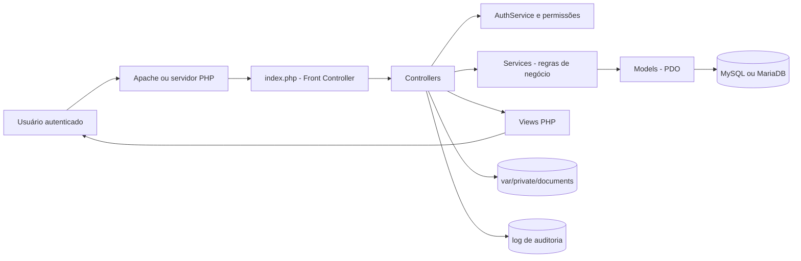
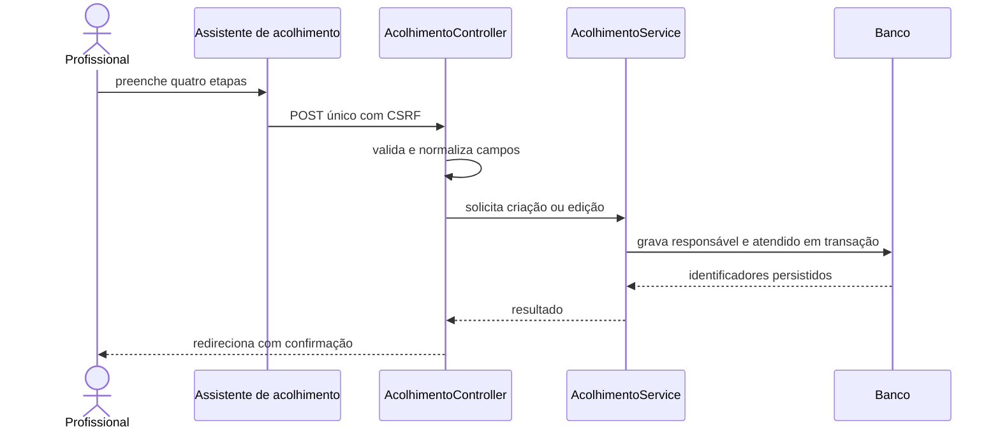
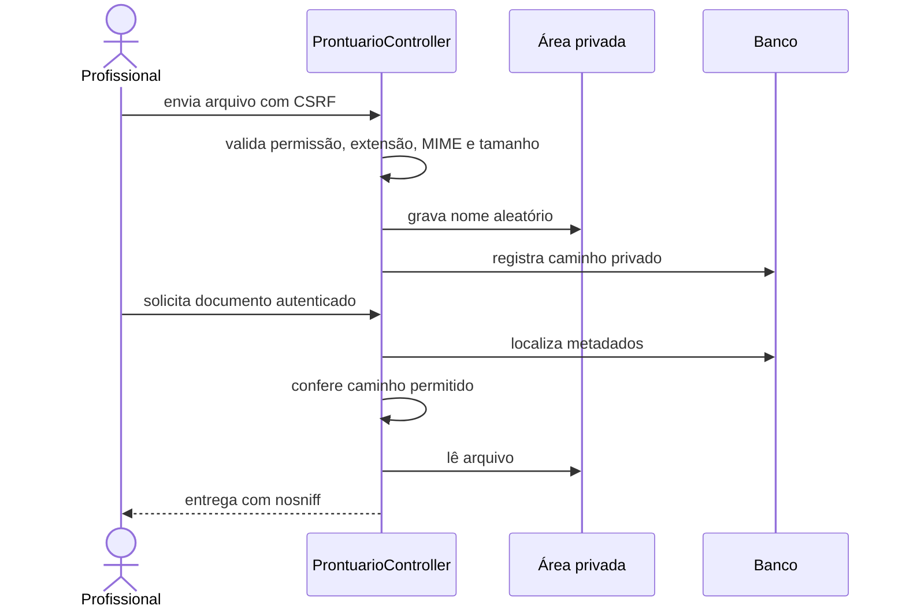
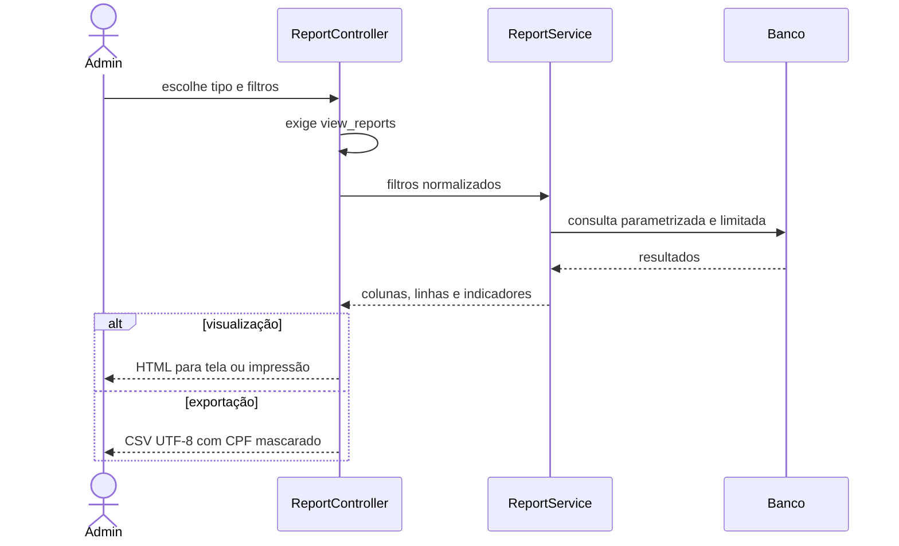

# Arquitetura e Fluxos

## Componentes

O projeto usa MVC sem framework. `index.php` resolve as rotas; controllers
validam autenticação, permissão e CSRF; services concentram regras; models acessam
o banco por consultas preparadas; views produzem a interface.

## Cadastro de acolhimento

## Documento de prontuário

## Relatórios

