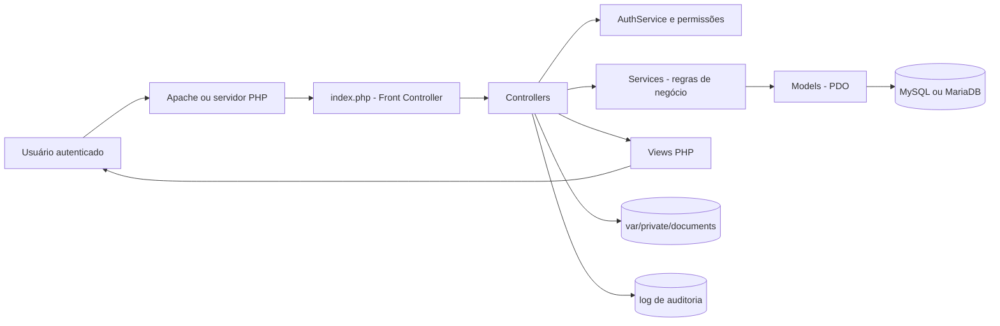
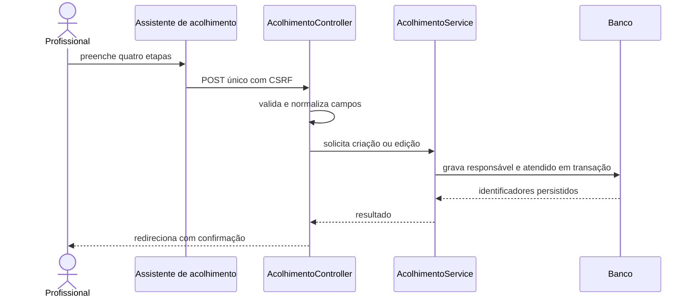
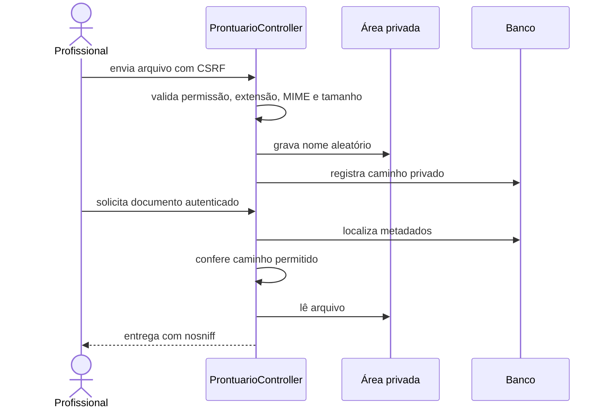
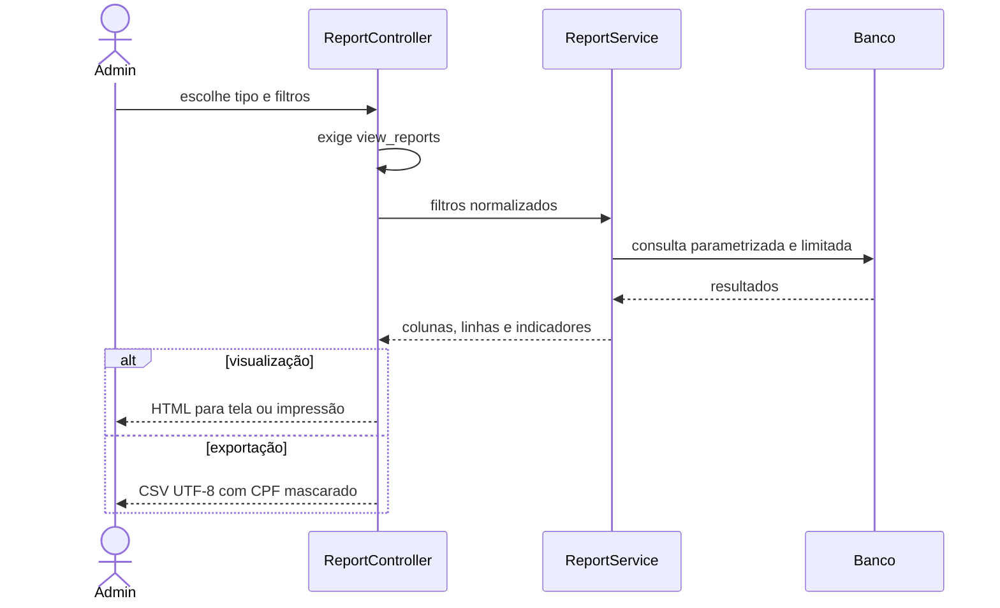

# Arquitetura e Fluxos

## Componentes

O projeto usa MVC sem framework. `index.php` resolve as rotas; controllers
validam autenticação, permissão e CSRF; services concentram regras; models acessam
o banco por consultas preparadas; views produzem a interface.

## Cadastro de acolhimento

## Documento de prontuário

## Relatórios

## Diagrama de Classes — Camada de aplicação

O diagrama abaixo atende à modelagem UML pedida para a aplicação atual. Para
manter a leitura, mostra as operações públicas mais representativas e as
dependências principais; métodos utilitários privados continuam no código.

```mermaid
classDiagram
    direction LR

    class BaseController {
        #AuthService authService
        +__construct()
        #render(view, data)
        #requireAuth()
        #requirePermission(permission)
        #validateCSRF()
        #redirectWithError(url, message)
    }
    class AuthController {
        +showLogin()
        +processLogin()
        +logout()
        +processForgotPassword()
        +processResetPassword()
    }
    class DashboardController {
        -AcolhimentoService acolhimentoService
        -SocioeconomicoService socioeconomicoService
        +index()
        +saveCalendarNote()
        +getCalendarNotes()
    }
    class AcolhimentoController {
        -AcolhimentoService acolhimentoService
        +index()
        +create()
        +store()
        +show(id)
        +update(id)
        +delete(id)
    }
    class SocioeconomicoController {
        -SocioeconomicoService socioeconomicoService
        +index()
        +create()
        +store()
        +show(id)
        +update(id)
        +delete(id)
        +report()
    }
    class FaltasController {
        -FrequenciaDia frequenciaDiaDB
        -FrequenciaOficina frequenciaOficinaDB
        -Oficina oficinaDB
        -Desligamento desligamentoDB
        +index()
        +salvarDia()
        +salvarOficina()
        +alertas()
    }
    class DesligamentoController {
        -Desligamento desligamentoDB
        -FrequenciaDia frequenciaDiaDB
        +index()
        +salvar()
        +reativar()
        +automatico()
    }
    class ProntuarioController {
        -AcolhimentoService acolhimentoService
        -SocioeconomicoService socioeconomicoService
        +index()
        +show(cpf=null, id=null)
        +uploadDocument()
        +viewDocument(id)
    }
    class PsychologyController {
        -PsychologyService psychologyService
        +index()
        +patients()
        +patient(cpf)
        +saveNote()
        +updateNote()
        +deleteNote()
    }
    class UserController {
        -UserService userService
        +index()
        +store()
        +update(id)
        +delete(id)
        +toggleStatus(id)
    }
    class LogController {
        -Log logModel
        -User userModel
        +index()
        +search()
        +show()
    }
    class ReportController {
        -ReportService reportService
        +index()
        +export()
    }
    class ProfileController {
        +index()
        +updatePhoto()
        +viewPhoto()
        +updatePassword()
    }

    class AuthService {
        -User userModel
        +login(email, password)
        +logout()
        +hasPermission(permission)
        +requirePermission(permission)
    }
    class AcolhimentoService {
        -Acolhimento acolhimentoModel
        +listFichas(page, perPage, filters)
        +createFicha(data)
        +updateFicha(id, data)
    }
    class SocioeconomicoService {
        -Socioeconomico socioeconomicoModel
        +listFichas(page, perPage, filters)
        +createFicha(data)
        +updateFicha(id, data)
        +generateReport(filters)
    }
    class PsychologyService {
        -PsychologyNote noteModel
        -Acolhimento acolhimentoModel
        +getAllPatients()
        +saveNote(data)
        +getStatistics()
    }
    class UserService {
        -User userModel
        -Log logModel
        +getAllUsers()
        +createUser(data)
        +updateUser(id, data)
    }
    class ReportService {
        -PDO pdo
        -int MAX_ROWS
        +generate(type, filters)
        +exportCsv(report)
    }
    class RateLimitService {
        -PDO pdo
        +isAllowed(action, identifier, maxAttempts, windowSeconds)
        +hit(action, identifier, maxAttempts, windowSeconds, blockSeconds)
        +clear(action, identifier)
    }
    class BaseModel {
        <<abstract>>
        #string table
        #string primaryKey
        #PDO pdo
        +findById(id)
        +findAll()
        +update(id, data)
        +delete(id)
        #query(sql, params)
    }
    class Acolhimento
    class Socioeconomico
    class User
    class FrequenciaDia
    class FrequenciaOficina
    class Oficina
    class Desligamento
    class Document
    class PsychologyNote
    class PasswordResetToken
    class Log

    BaseController <|-- AuthController
    BaseController <|-- DashboardController
    BaseController <|-- AcolhimentoController
    BaseController <|-- SocioeconomicoController
    BaseController <|-- FaltasController
    BaseController <|-- DesligamentoController
    BaseController <|-- ProntuarioController
    BaseController <|-- PsychologyController
    BaseController <|-- UserController
    BaseController <|-- LogController
    BaseController <|-- ReportController
    BaseController <|-- ProfileController

    BaseController --> AuthService
    AuthController --> AuthService
    AuthController ..> RateLimitService
    AuthController ..> User
    AuthController ..> PasswordResetToken
    DashboardController --> AcolhimentoService
    DashboardController --> SocioeconomicoService
    AcolhimentoController --> AcolhimentoService
    SocioeconomicoController --> SocioeconomicoService
    ProntuarioController --> AcolhimentoService
    ProntuarioController --> SocioeconomicoService
    ProntuarioController ..> Document
    ProntuarioController ..> FrequenciaDia
    ProntuarioController ..> Desligamento
    PsychologyController --> PsychologyService
    UserController --> UserService
    ReportController --> ReportService
    FaltasController --> FrequenciaDia
    FaltasController --> FrequenciaOficina
    FaltasController --> Oficina
    FaltasController --> Desligamento
    FaltasController ..> Acolhimento
    DesligamentoController --> Desligamento
    DesligamentoController --> FrequenciaDia
    DesligamentoController ..> Acolhimento
    LogController --> Log
    ProfileController --> User

    AcolhimentoService --> Acolhimento
    SocioeconomicoService --> Socioeconomico
    PsychologyService --> PsychologyNote
    PsychologyService --> Acolhimento
    PsychologyService ..> Log
    UserService --> User
    UserService --> Log
    AuthService --> User
    BaseModel <|-- Acolhimento
    BaseModel <|-- Socioeconomico
    BaseModel <|-- User
    BaseModel <|-- FrequenciaDia
    BaseModel <|-- FrequenciaOficina
    BaseModel <|-- Oficina
    BaseModel <|-- Desligamento
    BaseModel <|-- Document
    BaseModel <|-- PsychologyNote
    BaseModel <|-- PasswordResetToken
    BaseModel <|-- Log
```

Uma versão diagramada em A3, com o DER completo, a matriz das 21 chaves
estrangeiras e os diagramas UML separados por camada, está disponível em
`output/pdf/Diagramas_DER_UML_Crianca_Feliz.pdf`.

### Leitura do diagrama

- Todas as rotas de negócio passam por controllers que herdam de
  `BaseController`, responsável por autenticação, autorização, CSRF,
  renderização e redirecionamento seguro.
- Services concentram as regras de negócio; Models concentram persistência via
  PDO e herdam operações genéricas de `BaseModel` quando aplicável.
- `AuthService` é uma dependência transversal, usada para sessão e matriz de
  permissões dos perfis `admin`, `funcionario` e `psicologo`.
